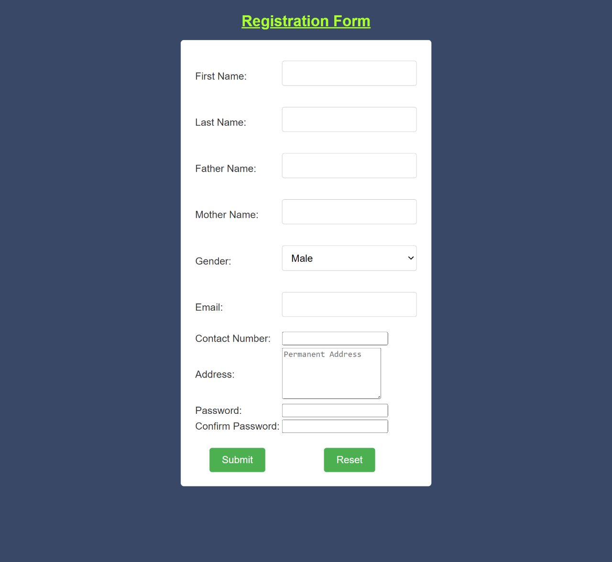

# Responsive Form

A user-friendly responsive form is a adaptive solution that seamlessly adjusts its layout across various devices and screen sizes. It offers an intuitive interface that ensures smooth user interaction on desktops, tablets, and smartphones. With its elegant design and effortless responsiveness, our form guarantees a consistent and enjoyable user experience, making data collection and submission a breeze for both you and your users.


## Tech Stack

**HTML || CSS || JavaScript** 


## Deployment

Visit live site

```bash
  https://gauravpathak77.github.io/Form
```


## Screenshots



